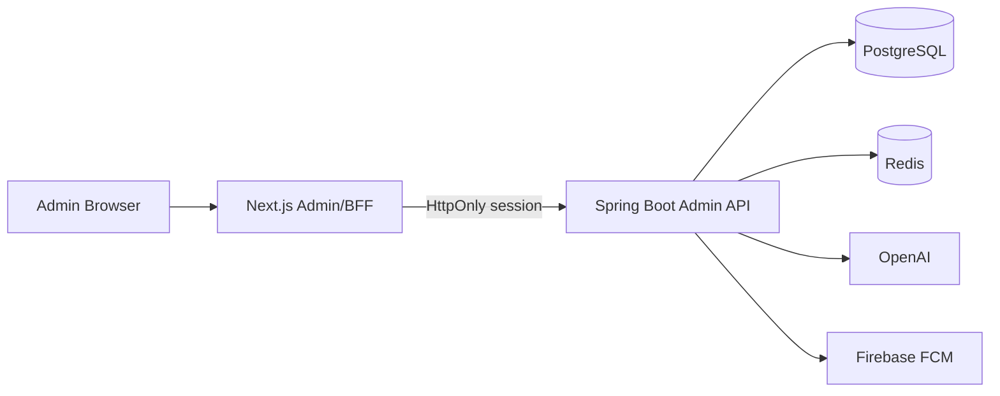

# My Pasture Admin

오늘의 말씀, AI 모델과 사용량, QT 모임, 알림, 쿠폰과 신고 콘텐츠를 운영하는 My Pasture 관리자 애플리케이션입니다.

> 관리자 화면은 공개 서비스가 아닙니다. 백엔드 `ADMIN` 권한과 서버 측 인증 검증을 모두 통과해야 접근할 수 있습니다.

## Related Repositories

- Backend: [mypasture-backend](https://github.com/ByeongDoo-Han/mypasture-backend)
- Mobile: [mypasture-app](https://github.com/ByeongDoo-Han/mypasture-app)
- Landing: [mypasture.app](https://mypasture.app)

## Operations Scope

| Area | Operations |
| --- | --- |
| 오늘의 말씀 | 생성 작업, 성경 검색, 편집, 검수, 게시, 반려와 장애 복구 |
| AI 모델 | 생성·평가 모델, prompt 설정, 적용 이력과 사용량 확인 |
| 성경 해설 | 장별 생성 작업, 결과 검수, 게시와 반려 |
| QT 모임 | 상태 조회, 종료·QR 폐기, 감사 이력 확인 |
| 알림 | FCM 전달 상태, retry/dead 작업과 기기 lifecycle 확인 |
| 이메일 | 오늘의 말씀 email Outbox와 실패 작업 확인 |
| 쿠폰 | 캠페인 생성, 사용 기간·횟수와 꾸미기 보상 관리 |
| Moderation | AI 답변·QT 콘텐츠 신고 검토와 운영 조치 |

## Architecture

관리자 브라우저는 백엔드 token을 직접 저장하지 않습니다. Next.js BFF route가 HttpOnly cookie를 사용하고 서버에서 현재 사용자와 `ADMIN` 역할을 다시 확인한 뒤 백엔드 운영 API를 호출합니다.



운영 화면은 비동기 작업을 즉시 성공으로 표시하지 않고 `QUEUED`, `PROCESSING`, `COMPLETED`, `FAILED` 같은 서버 상태를 조회합니다.

## Tech Stack

- Next.js 16, React 19, TypeScript
- TanStack Query, Zod
- Tailwind CSS, Lucide Icons
- Next.js Route Handler based BFF

## Project Structure

```text
src
├── app
│   ├── (protected)
│   ├── api
│   └── login
├── components
├── features
│   ├── ai-models
│   ├── bible-commentary
│   ├── coupon
│   ├── daily-word
│   ├── moderation
│   ├── notification
│   └── quiet-time
└── lib
```

각 feature는 운영 UI, backend API client와 BFF proxy를 함께 관리합니다.

## Local Development

### Requirements

- Node.js 22
- npm 10+
- running My Pasture backend
- backend `ADMIN` role account

### Configuration

```bash
npm ci
cp .env.local.example .env.local
```

기본 로컬 설정은 다음과 같습니다.

```dotenv
APP_ENV=local
API_BASE_URL=http://localhost:8080
```

실제 관리자 계정, token과 운영 비밀은 `.env` 파일에 기록하지 않습니다.

### Run

```bash
npm run dev:local
```

`http://localhost:3000`에 접속한 뒤 백엔드에서 `ADMIN` 역할이 부여된 계정으로 로그인합니다.

## Validation

```bash
npm run typecheck
cp .env.prod.example .env.prod
npm run build:prod
npm audit --omit=dev --audit-level=high
```

CI는 TypeScript 검사, production dependency audit와 Next.js production build를 실행합니다.

## Security

- 로그인 후에도 서버 렌더링과 BFF에서 `ADMIN` 역할을 다시 검증합니다.
- access token은 브라우저 JavaScript가 읽을 수 없는 HttpOnly·SameSite cookie에 저장합니다.
- BFF는 임의의 외부 URL을 proxy하지 않고 허용된 backend path만 호출합니다.
- mutation은 backend 권한 검증과 감사 operation ID를 사용합니다.
- 운영 API key, OAuth secret과 사용자 token을 client bundle에 포함하지 않습니다.
- 사용자 생성 콘텐츠는 원문을 무분별하게 노출하지 않고 신고·차단 정책에 따라 처리합니다.

## Documentation

- [Daily word operations](docs/daily-word-operations.ko.md)
- [Notification operations](docs/notification-operations.ko.md)
- [Admin authentication](docs/security-auth.ko.md)
- Backend [API specification](https://github.com/ByeongDoo-Han/mypasture-backend/blob/main/docs/api-spec.md)
- Backend [Architecture](https://github.com/ByeongDoo-Han/mypasture-backend/tree/main/docs/architecture)

## Deployment Notes

- `API_BASE_URL`은 서버에서 접근 가능한 HTTPS backend 주소를 사용합니다.
- production build에 local URL 또는 테스트 계정을 포함하지 않습니다.
- backend API와 admin UI를 함께 변경할 때는 호환 가능한 API 배포 순서를 확인합니다.
- destructive operation은 별도 승인, 감사 로그와 복구 절차를 갖춰야 합니다.

## Contribution Workflow

1. GitHub Issue를 작성합니다.
2. 최신 `main`에서 `feat/<domain>-<issue>-<description>` 브랜치를 만듭니다.
3. TypeScript, audit와 production build를 통과시킵니다.
4. `main` 대상 PR의 CI가 성공하면 merge합니다.
